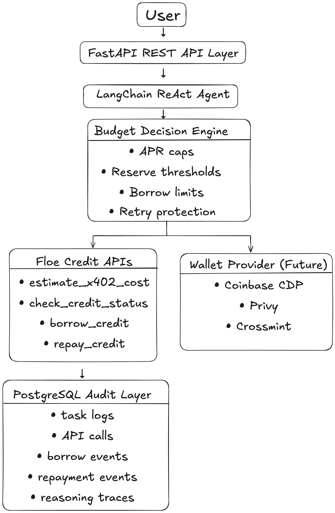
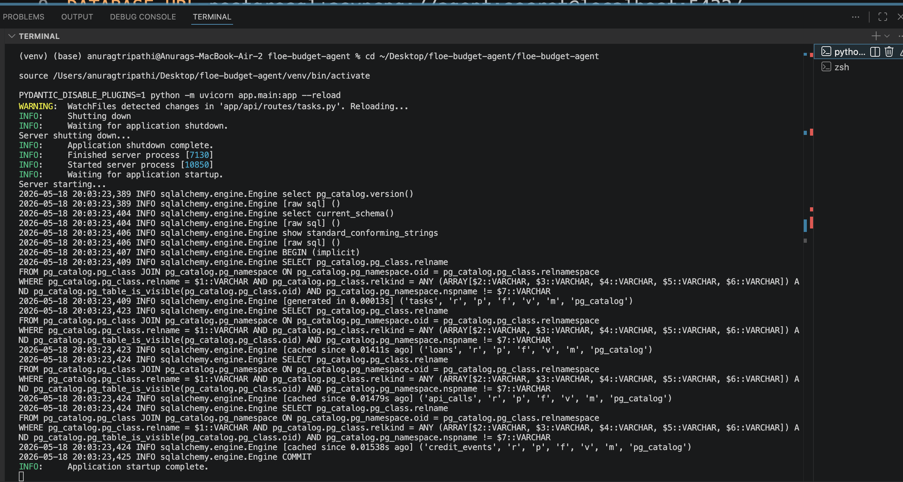
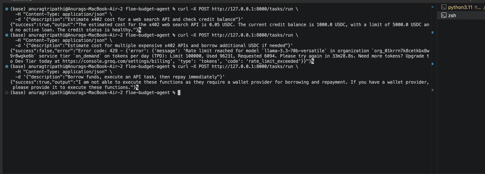

Autonomous AI financial orchestration agent built with FastAPI, PostgreSQL, LangChain, and x402 credit estimation.

## Features

- Autonomous task execution
- x402 cost estimation
- Credit status checks
- Borrow/repay decision engine
- PostgreSQL audit persistence
- Async FastAPI backend
- ReAct agent orchestration
- Dockerized PostgreSQL

## Stack

- FastAPI
- PostgreSQL
- SQLAlchemy Async
- LangChain
- Docker
- Groq / Gemini
- Floe Credit APIs

## Example Flow

1. Estimate x402 API cost
2. Check available credit
3. Determine shortfall
4. Decide whether borrowing is needed
5. Execute repayment logic
6. Persist audit logs

## Run Locally

```bash
docker start floe-postgres

## Architecture






source venv/bin/activate

python -m uvicorn app.main:app --reload
```

## API Example

```bash
curl -X POST http://127.0.0.1:8000/tasks/run \
-H "Content-Type: application/json" \
-d '{"description":"Estimate x402 cost and check credit balance"}'
```

## Current Limitations

- Wallet provider not yet connected
- Some flows still mocked
- Rate limits depend on LLM provider

## Future Work

- Wallet provider integration
- Multi-agent spend isolation
- Live dashboard
- OpenTelemetry tracing
- Production deployment
